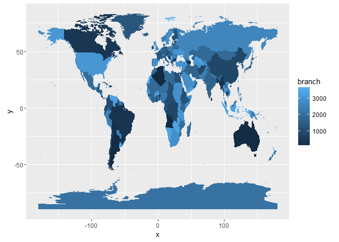
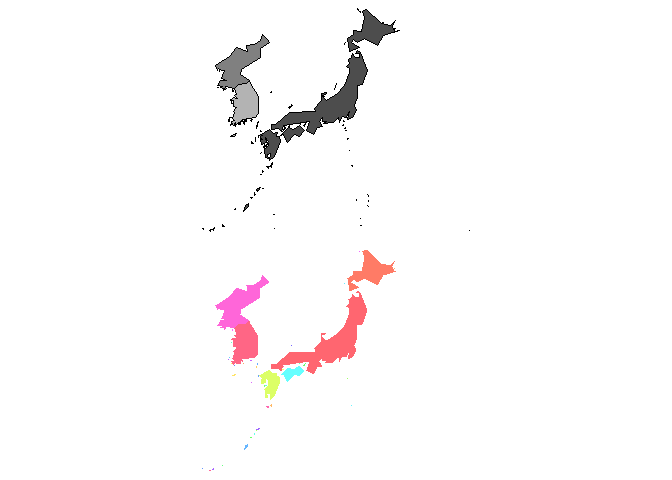
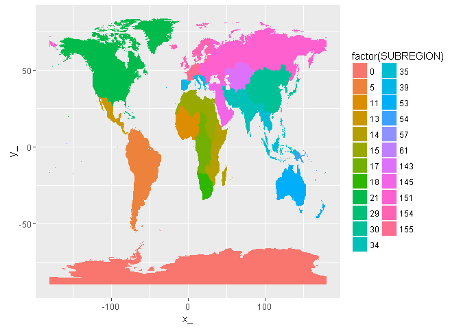
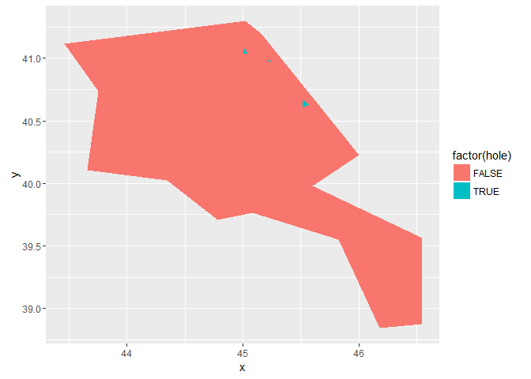
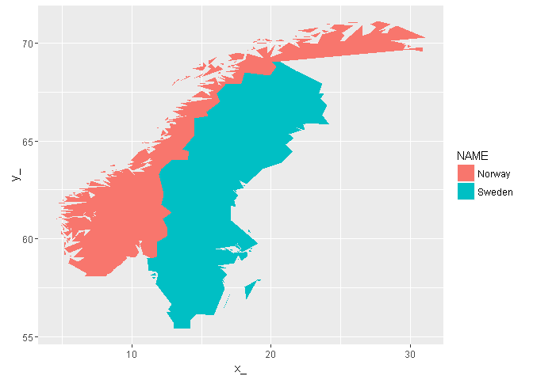
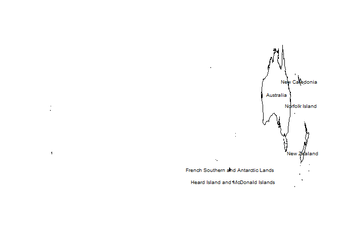
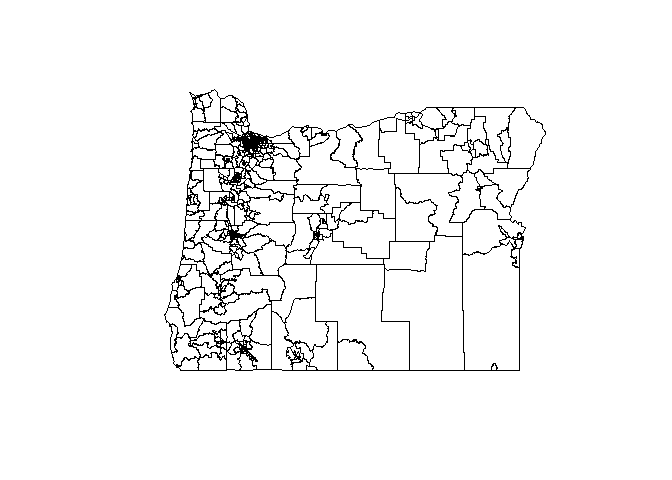

[](https://travis-ci.org/mdsumner/spbabel)

<!-- README.md is generated from README.Rmd. Please edit that file -->
spbabel: bisque or bouillon?
============================

Part of an effort towards dplyr/table-fication of Spatial classes and the spatial-zoo in R. Inspired by Eonfusion and Manifold and dplyr and Douglas Adams and spurned on by helpful twitter and ropensci discussions.

Installation
------------

Spbabel can be installed directly from github:

``` r
devtools::install_github("mdsumner/spbabel")
```

What is the spatial babel for?
==============================

Spatial data in the `sp` package have a formal definition that is modelled on shapefiles, and close at least in spirit to the Simple Features definition. <https://github.com/edzer/sfr>

Embedded nesting
----------------

Still working on the terminology here, does "embedding" make sense?

This approach stores a single table at the top level, but it only stores the tables that we need - it's not a recursive object with a table split across rows. This means we can still normalize across objects (unique vertices), and apply operations on the entire set of rows (e.g. all vertices) without unnesting or recursing. Yes this also means shared topology.

Here is an example of "embedding".

``` r
library(spbabel)
#> Loading required package: sp
library(maptools)
#> Checking rgeos availability: TRUE
data(wrld_simpl)
world <- db_df(wrld_simpl)

world$Table
#> $Coord
#> Source: local data frame [26,264 x 3]
#> 
#>             x        y branch
#>         (dbl)    (dbl)  (int)
#> 1  -61.686668 17.02444      1
#> 2  -61.887222 17.10527      1
#> 3  -61.794449 17.16333      1
#> 4  -61.686668 17.02444      1
#> 5  -61.729172 17.60861      2
#> 6  -61.853058 17.58305      2
#> 7  -61.873062 17.70389      2
#> 8  -61.729172 17.60861      2
#> 9    2.963610 36.80222      3
#> 10   4.785832 36.89472      3
#> ..        ...      ...    ...
#> 
#> $Branch
#> Source: local data frame [3,768 x 3]
#> 
#>    branch  hole object
#>     (int) (lgl)  (int)
#> 1       1 FALSE      1
#> 2       2 FALSE      1
#> 3       3 FALSE      2
#> 4       4 FALSE      3
#> 5       5 FALSE      3
#> 6       6 FALSE      3
#> 7       7 FALSE      3
#> 8       8 FALSE      3
#> 9       9 FALSE      4
#> 10     10 FALSE      5
#> ..    ...   ...    ...
#> 
#> $Object
#> Source: local data frame [246 x 12]
#> 
#>      FIPS   ISO2   ISO3    UN                NAME   AREA  POP2005 REGION
#>    (fctr) (fctr) (fctr) (int)              (fctr)  (int)    (dbl)  (int)
#> 1      AC     AG    ATG    28 Antigua and Barbuda     44    83039     19
#> 2      AG     DZ    DZA    12             Algeria 238174 32854159      2
#> 3      AJ     AZ    AZE    31          Azerbaijan   8260  8352021    142
#> 4      AL     AL    ALB     8             Albania   2740  3153731    150
#> 5      AM     AM    ARM    51             Armenia   2820  3017661    142
#> 6      AO     AO    AGO    24              Angola 124670 16095214      2
#> 7      AQ     AS    ASM    16      American Samoa     20    64051      9
#> 8      AR     AR    ARG    32           Argentina 273669 38747148     19
#> 9      AS     AU    AUS    36           Australia 768230 20310208      9
#> 10     BA     BH    BHR    48             Bahrain     71   724788    142
#> ..    ...    ...    ...   ...                 ...    ...      ...    ...
#> Variables not shown: SUBREGION (int), LON (dbl), LAT (dbl), object (int)
```

How to reconstitute these objects?

``` r
nam <- c("Australia", "New Zealand")
library(dplyr)
Objects <- function(x) x$Table$Object
Branches <- function(x) x$Table$Branch
Coords <- function(x) x$Table$Coord

(countryObjects <- Objects(world) %>% select(NAME, object) %>% filter(NAME %in% nam) )
#> Source: local data frame [2 x 2]
#> 
#>          NAME object
#>        (fctr)  (int)
#> 1   Australia      9
#> 2 New Zealand    160

countries <- countryObjects %>% inner_join(Branches(world)) %>% inner_join(Coords(world))
#> Joining by: "object"
#> Joining by: "branch"

spFromTable(countries, attr = countryObjects, quiet = TRUE)
#> class       : SpatialPolygonsDataFrame 
#> features    : 2 
#> extent      : -178.6131, 179.0769, -54.74973, -10.05167  (xmin, xmax, ymin, ymax)
#> coord. ref. : NA 
#> variables   : 2
#> Source: local data frame [2 x 2]
#> 
#>           dat    id
#>        (fctr) (int)
#> 1   Australia     1
#> 2 New Zealand     2
```

Why do this?
------------

I want these things:

-   flexibility in the number and type/s of attribute stored as "coordinates", x, y, lon, lat, z, time, temperature, etc.
-   shared vertices
-   ability to store points, lines and areas together, sharing topology where appropriate

Recursive nesting
-----------------

I'm not particularly fond of this approach, since you need to nest two levels down in order to have tables of coordinates for parts, and tables of parts for objects. This means we start reproducing the recursive list structures we started with. Better is to store separate tables for distinct entities and keep rules for table views.

Recent discussion resulted in a "nested data frame" approach, I've applied that in `nested.r` with two-levels of nesting, Objects as the table to store each Branch (part or piece or ring or linestring), and each Branch table stores actual vertices (x, y).

This example shows raw round-tripping, just to prove it mostly works.

``` r
library(tidyr)
library(spbabel)
library(maptools)
data(wrld_simpl)
xa <- nest(wrld_simpl)
## method for plotting this nsp_df (nested sp df) shows round-trip back to Spatial
plot(xa, col = grey(seq(0, 1, length = nrow(xa))))
```

<!-- -->

``` r

## ggplot2
library(ggplot2)
library(tidyr)

## custom stat for this nested "nsp_df" object
ggplot(xa) + stat_nested()
```

<!-- -->

This example shows we can pipeline in simple ways.

Filter out by country NAME.

``` r
library(dplyr)

xa %>% filter(NAME %in% c("Australia", "New Zealand")) %>% 
 ggplot() + stat_nested()
```

<!-- -->

Extract the full vertices table (with all object attributes dropped), filter-join on any objects that have holes and pick one to plot.

(Here the cascade of un-nesting should extract the branch-level metadata, i.e. winding order, hole-status, area, etc.)

Using `geom_holygon` we can get true polypaths.

``` r
xa %>% inner_join(spbabel:::vertices(xa) %>% filter(hole == 1) %>% distinct(object)  %>% select(object)) %>%  
  filter(row_number() == 17) %>% ggplot() + geom_holygon() 
#> Joining by: "object"
```

<!-- -->

``` r


sptable(subset(wrld_simpl, NAME == "Armenia"))
#> Source: local data frame [27 x 7]
#> 
#>    object  part branch  hole order        x        y
#>     (int) (int)  (int) (lgl) (int)    (dbl)    (dbl)
#> 1       1     1      1 FALSE     1 45.15387 41.19860
#> 2       1     1      1 FALSE     2 46.00194 40.22555
#> 3       1     1      1 FALSE     3 45.59582 39.97804
#> 4       1     1      1 FALSE     4 46.54138 39.56444
#> 5       1     1      1 FALSE     5 46.54038 38.87559
#> 6       1     1      1 FALSE     6 46.17825 38.84115
#> 7       1     1      1 FALSE     7 45.81999 39.54972
#> 8       1     1      1 FALSE     8 45.08332 39.76805
#> 9       1     1      1 FALSE     9 44.77886 39.70638
#> 10      1     1      1 FALSE    10 44.34722 40.02389
#> ..    ...   ...    ...   ...   ...      ...      ...
armenia <- xa %>% filter(NAME == "Armenia") 

ggplot(armenia, aes(x, y, group = branch, fill = factor(hole))) + stat_nested()
```

<!-- -->

Much more to do . . .

``` r
## how to pass down object for faceting . . .
#xa %>% inner_join(spbabel:::vertices(xa) %>% filter(hole == 1) %>% distinct(object)  %>% select(object)) %>%  
#   ggplot() + stat_nested() + facet_grid(branch)
```

Have a closer look at what happens, we need to keep at least `Object`, and we copy out `ISO3` to all vertices. This is essentially an implicit join, made simpler since rows store data frames 'recursively'.

``` r
library(dplyr)
library(tidyr)

## Be careful to keep the nested Object table - here see all vertices
xa %>% select(Object, ISO3) %>% unnest() %>% unnest()
#> Source: local data frame [26,264 x 7]
#> 
#>      ISO3 branch  part  hole order          x        y
#>    (fctr)  (int) (int) (lgl) (int)      (dbl)    (dbl)
#> 1     ATG      1     1 FALSE     1 -61.686668 17.02444
#> 2     ATG      1     1 FALSE     2 -61.887222 17.10527
#> 3     ATG      1     1 FALSE     3 -61.794449 17.16333
#> 4     ATG      1     1 FALSE     4 -61.686668 17.02444
#> 5     ATG      2     2 FALSE     1 -61.729172 17.60861
#> 6     ATG      2     2 FALSE     2 -61.853058 17.58305
#> 7     ATG      2     2 FALSE     3 -61.873062 17.70389
#> 8     ATG      2     2 FALSE     4 -61.729172 17.60861
#> 9     DZA      3     1 FALSE     1   2.963610 36.80222
#> 10    DZA      3     1 FALSE     2   4.785832 36.89472
#> ..    ...    ...   ...   ...   ...        ...      ...
```

Questions: how do we protect special columns, like "Object" - and how do we ensure they are recorded when unnested? Same goes for PROJ.4 string, here I use an attribute.

I also tried store list of Polygons() in the column, that's kind of simple but you need S3 methods for everything - this is is `sp-df.r`.

Nested data frames are much easier, I find it more natural to use two-level nesting, but you could go further to store more information on individual pieces, their area, winding, etc. You could also just store the fortify-table at one level nesting, more to experiment with.

*See gris for deduplication of vertices - we cannot do that with nesting afaics.*

Usage
-----

Apply pipeline modifications to the attribute data of `sp` objects with dplyr verbs.

``` r
data(quakes)
library(sp)
coordinates(quakes) <- ~long+lat
library(spbabel)
## plot a subset of locations by number of stations
quakes %>% dplyr::filter(mag <5.5 & mag > 4.5) %>% select(stations) %>% spplot
```

<!-- -->

We can use polygons and lines objects as well.

``` r
library(maptools)
data(wrld_simpl)

x <- wrld_simpl %>% mutate(lon = coordinates(wrld_simpl)[,1], lat = coordinates(wrld_simpl)[,2]) %>% filter(lat < -20, lon > 60) %>% select(NAME)
plot(x, asp = ""); text(coordinates(x), label = x$NAME, cex = 0.6)
```

<!-- -->

use the `sptable<-` replacment method to modify the underlying geometric attributes (here `x` and `y` is assumed no matter what coordinate system).

``` r
## standard dplyr on this S4 class
w2 <- filter(wrld_simpl, NAME == "Australia")
plot(w2, col = "grey")

## modify the geometry on this object
sptable(w2) <- sptable(w2) %>% mutate(x = x - 5)
#> Warning in spFromTable(value, proj4string(object), as.data.frame(object)):
#> modifications removed the relation between object and data, using a dummy
#> data frame of attributes

plot(w2, add = TRUE)
```

<!-- -->

We can also restructure objects.

``` r
## explode (disaggregate) objects to individual polygons
## here each part becomes and object, and each object only has one part
w3 <- spFromTable(sptable(w2)  %>% mutate(object = part, part = 1), crs = proj4string(w2))
#> Warning in spFromTable(sptable(w2) %>% mutate(object = part, part = 1), :
#> modifications removed the relation between object and data, using a dummy
#> data frame of attributes
```

TODO
----

Create idioms for modifying the geometry with dplyr verbs and/or piping.

Consider whether `summarise` is a sensible for Spatial.

Can we do geometry manipulations like `sptable(w2) <- sptable(w2) %>% mutate(object = part, part = 1)` and sensibly restore the attributes on the way? Just copy the value outs?

Implement `sample_n` and `sample_frac`.

Implement the joins.

Approach
--------

Create methods for the dplyr verbs: filter, mutate, arrange, select etc.

This is part of an overall effort to normalize Spatial data in R, to create a system that can be stored in a database.

Functions `sptable` and `spFromTable` create `tbl_df`s from Spatial classes and round trip them. This is modelled on `raster::geom rather` than `ggplot2::fortify`, but perhaps only since I use raster constantly and ggplot2 barely ever.

Complicating factors are the rownames of sp and the requirement for them both on object IDs and data.frame rownames, and the sense in normalizing the geometry to the table of coordinates without copying attributes.

(See `mdsumner/gris` for normalizing further to unique vertices and storing parts and objects and vertices on different tables. Ultimately this should all be integrated into one consistent approach.)

Thanks to @holstius for prompting a relook under the hood of dplyr for where this should go: <https://gist.github.com/holstius/58818dc9bbb88968ec0b>

This package `spbabel` and these packages should be subsumed partly in the overall scheme:

<https://github.com/mdsumner/dplyrodbc> <https://github.com/mdsumner/manifoldr>
