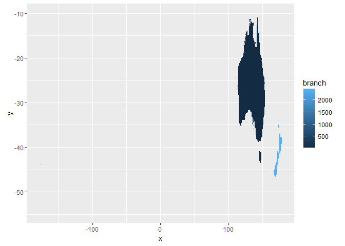

<!-- README.md is generated from README.Rmd. Please edit that file -->
    ## 
    ## Attaching package: 'dplyr'

    ## The following objects are masked from 'package:stats':
    ## 
    ##     filter, lag

    ## The following objects are masked from 'package:base':
    ## 
    ##     intersect, setdiff, setequal, union

spbabel
-------

Part of a long-dreamed of "babelfish" basis for the Spatial classes and the spatial-zoo in R. Inspired by Eonfusion and dplyr so we can treat Spatial like DB rather than Special.

Installation
------------

Spbabel can be installed directly from github:

``` r
devtools::install_github("mdsumner/spbabel")
```

Usage
-----

Apply pipeline modifications to the attribute data of `sp` objects with dplyr verbs.

``` r
data(quakes)
library(sp)
coordinates(quakes) <- ~long+lat
library(spbabel)
## plot a subset of locations by number of stations
quakes %>% dplyr::filter(mag <5.5 & mag > 4.5) %>% select(stations) %>% spplot
```

<!-- -->

We can use polygons and lines objects as well.

``` r
library(maptools)
#> Checking rgeos availability: TRUE
data(wrld_simpl)

x <- wrld_simpl %>% mutate(lat = coordinates(wrld_simpl)[,2]) %>% filter(lat < -40) %>% select(NAME)
plot(x); text(coordinates(x), label = x$NAME, cex = 0.6)
```

<!-- -->

TODO
----

Create idioms for modifying the geometry with dplyr verbs and/or piping.

Consider whether `summarise` is a sensible for Spatial.

Implement `sample_n` and `sample_frac`.

Implement the joins.

Approach
--------

Create methods for the dplyr verbs: filter, mutate, arrange, select etc.

This is part of an overall effort to normalize Spatial data in R, to create a system that can be stored in a database.

Functions `sptable` and `spFromTable` create `tbl_df`s from Spatial classes and round trip them. This is modelled on `raster::geom rather` than `ggplot2::fortify`, but perhaps only since I use raster constantly and ggplot2 barely ever.

Complicating factors are the rownames of sp and the requirement for them both on object IDs and data.frame rownames, and the sense in normalizing the geometry to the table of coordinates without copying attributes.

(See `mdsumner/gris` for normalizing further to unique vertices and storing parts and objects and vertices on different tables. Ultimately this should all be integrated into one consistent approach.)

Thanks to @holstius for prompting a relook under the hood of dplyr for where this should go: <https://gist.github.com/holstius/58818dc9bbb88968ec0b>

This package `spbabel` and these packages should be subsumed partly in the overall scheme:

<https://github.com/mdsumner/dplyrodbc> <https://github.com/mdsumner/manifoldr>
